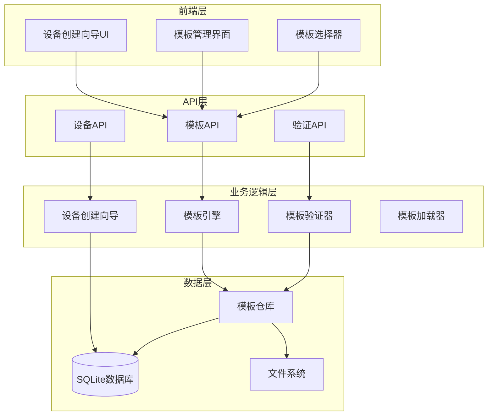

# 设备模板系统设计文档

## 概述

设备模板系统是一个基于JSON模板的设备快速创建解决方案，旨在简化IoT设备的添加和配置流程。系统通过预定义的设备模板，让用户能够快速选择合适的设备类型，并自动生成相应的设备属性和命令配置。

该系统采用模块化设计，包含模板管理、模板引擎、设备创建向导等核心组件，支持内置模板和自定义模板，提供完整的模板生命周期管理。

## 架构

### 系统架构图



### 分层架构

1. **表现层 (Presentation Layer)**
   - 设备创建向导UI：基于React的分步骤设备创建界面
   - 模板管理界面：管理员用于管理设备模板的界面
   - 模板选择器：用户选择设备模板的交互组件

2. **API层 (API Layer)**
   - 模板API：提供模板的CRUD操作和查询功能
   - 设备API：扩展现有设备API，支持基于模板创建设备
   - 验证API：提供模板验证和预览功能

3. **业务逻辑层 (Business Logic Layer)**
   - 模板引擎：解析和应用设备模板的核心组件
   - 模板验证器：验证模板格式和内容的正确性
   - 设备创建向导：协调模板应用和设备创建流程
   - 模板加载器：负责加载内置和自定义模板

4. **数据层 (Data Layer)**
   - 模板仓库：管理模板的存储和检索
   - SQLite数据库：存储设备模板元数据
   - 文件系统：存储模板JSON文件

## 组件和接口

### 核心组件

#### 1. 设备模板 (DeviceTemplate)

```rust
#[derive(Debug, Clone, Serialize, Deserialize)]
#[serde(rename_all = "snake_case")]
pub struct DeviceTemplate {
    pub id: String,
    pub name: String,
    pub display_name: HashMap<String, String>, // 多语言支持
    pub description: HashMap<String, String>,
    pub version: String,
    pub author: Option<String>,
    pub category: String,
    pub manufacturer: Option<String>,
    pub device_type: String,
    pub protocol_type: Option<String>,
    pub driver_name: Option<String>,
    pub tags: Vec<String>,
    pub device_info: DeviceInfo,
    pub properties: Vec<PropertyTemplate>,
    pub commands: Vec<CommandTemplate>,
    pub created_at: String,
    pub updated_at: String,
}

#[derive(Debug, Clone, Serialize, Deserialize)]
#[serde(rename_all = "snake_case")]
pub struct DeviceInfo {
    pub default_name_pattern: String, // 例如: "{manufacturer}_{device_type}_{index}"
    pub default_display_name_pattern: Option<String>,
    pub default_description: Option<HashMap<String, String>>,
    pub default_position: Option<String>,
    pub default_driver_options: Option<String>,
    pub required_fields: Vec<String>, // 用户必须填写的字段
}

#[derive(Debug, Clone, Serialize, Deserialize)]
#[serde(rename_all = "snake_case")]
pub struct PropertyTemplate {
    pub name: String,
    pub display_name: HashMap<String, String>,
    pub description: Option<HashMap<String, String>>,
    pub data_type: String,
    pub unit: Option<String>,
    pub min_value: Option<f64>,
    pub max_value: Option<f64>,
    pub default_value: Option<String>,
    pub is_read_only: bool,
    pub is_required: bool,
    pub validation_rules: Option<ValidationRules>, // 结构化的验证规则
}

#[derive(Debug, Clone, Serialize, Deserialize)]
#[serde(rename_all = "snake_case")]
pub enum ValidationRules {
    Number(NumberValidation),
    String(StringValidation),
    Enum { values: Vec<String> },
}

#[derive(Debug, Clone, Serialize, Deserialize)]
#[serde(rename_all = "snake_case")]
pub struct NumberValidation {
    pub min: Option<f64>,
    pub max: Option<f64>,
    pub precision: Option<u8>, // 小数位数
}

#[derive(Debug, Clone, Serialize, Deserialize)]
#[serde(rename_all = "snake_case")]
pub struct StringValidation {
    pub min_length: Option<usize>,
    pub max_length: Option<usize>,
    pub pattern: Option<String>,  // 正则表达式
}

#[derive(Debug, Clone, Serialize, Deserialize)]
#[serde(rename_all = "snake_case")]
pub struct CommandTemplate {
    pub name: String,
    pub display_name: HashMap<String, String>,
    pub description: Option<HashMap<String, String>>,
    pub parameters: Option<CommandParameters>, // 结构化的命令参数
    pub parameter_schema: Option<ParameterSchema>, // JSON Schema 格式的参数验证
    pub is_required: bool,
}

#[derive(Debug, Clone, Serialize, Deserialize)]
#[serde(rename_all = "snake_case")]
pub struct CommandParameters {
    #[serde(flatten)]
    pub fields: HashMap<String, ParameterValue>,
}

#[derive(Debug, Clone, Serialize, Deserialize)]
#[serde(rename_all = "snake_case", untagged)]
pub enum ParameterValue {
    Number(f64),
    String(String),
    Boolean(bool),
}

#[derive(Debug, Clone, Serialize, Deserialize)]
#[serde(rename_all = "snake_case")]
pub struct ParameterSchema {
    #[serde(rename = "type")]
    pub param_type: String,
    pub properties: HashMap<String, PropertySchema>,
    pub required: Vec<String>,
}

#[derive(Debug, Clone, Serialize, Deserialize)]
#[serde(rename_all = "snake_case")]
pub struct PropertySchema {
    #[serde(rename = "type")]
    pub param_type: String,
    pub minimum: Option<f64>,
    pub maximum: Option<f64>,
}
```

#### 2. 模板引擎 (TemplateEngine)

```rust
pub struct TemplateEngine {
    template_repository: Arc<TemplateRepository>,
    validator: Arc<TemplateValidator>,
}

impl TemplateEngine {
    pub async fn apply_template(
        &self,
        template_id: &str,
        user_input: &DeviceCreationInput,
    ) -> Result<CreateDeviceRequest, TemplateError>;
    
    pub async fn preview_template(
        &self,
        template_id: &str,
        user_input: &DeviceCreationInput,
    ) -> Result<DevicePreview, TemplateError>;
    
    pub async fn validate_user_input(
        &self,
        template_id: &str,
        user_input: &DeviceCreationInput,
    ) -> Result<ValidationResult, TemplateError>;
}

#[derive(Debug, Clone, Serialize, Deserialize)]
pub struct DeviceCreationInput {
    pub name: String,
    pub display_name: Option<String>,
    pub description: Option<String>,
    pub position: Option<String>,
    pub address: Option<String>,
    pub driver_options: Option<String>,
    pub parent_id: Option<String>,
    pub product_id: Option<String>,
    pub organization_id: Option<String>,
    pub property_values: HashMap<String, String>, // 属性默认值覆盖
    pub enabled_commands: Vec<String>, // 用户选择启用的命令
}

#[derive(Debug, Clone, Serialize, Deserialize)]
pub struct DevicePreview {
    pub device_info: CreateDeviceRequest,
    pub properties: Vec<CreateDevicePropertyRequest>,
    pub commands: Vec<CreateDeviceCommandRequest>,
    pub warnings: Vec<String>,
}
```

#### 3. 模板仓库 (TemplateRepository)

```rust
pub struct TemplateRepository {
    database: Arc<Database>,
    file_system_path: PathBuf,
}

impl TemplateRepository {
    pub async fn find_all(&self, params: &TemplateQueryParams) -> Result<Vec<DeviceTemplate>, RepositoryError>;
    pub async fn find_by_id(&self, id: &str) -> Result<Option<DeviceTemplate>, RepositoryError>;
    pub async fn find_by_category(&self, category: &str) -> Result<Vec<DeviceTemplate>, RepositoryError>;
    pub async fn search(&self, keyword: &str) -> Result<Vec<DeviceTemplate>, RepositoryError>;
    pub async fn create(&self, template: &DeviceTemplate) -> Result<DeviceTemplate, RepositoryError>;
    pub async fn update(&self, id: &str, template: &DeviceTemplate) -> Result<DeviceTemplate, RepositoryError>;
    pub async fn delete(&self, id: &str) -> Result<bool, RepositoryError>;
    pub async fn load_builtin_templates(&self) -> Result<Vec<DeviceTemplate>, RepositoryError>;
    pub async fn get_categories(&self) -> Result<Vec<TemplateCategory>, RepositoryError>;
}

#[derive(Debug, Clone, Serialize, Deserialize)]
pub struct TemplateQueryParams {
    pub category: Option<String>,
    pub manufacturer: Option<String>,
    pub device_type: Option<String>,
    pub protocol_type: Option<String>,
    pub keyword: Option<String>,
    pub page: Option<u32>,
    pub page_size: Option<u32>,
}

#[derive(Debug, Clone, Serialize, Deserialize)]
pub struct TemplateCategory {
    pub name: String,
    pub display_name: HashMap<String, String>,
    pub description: Option<HashMap<String, String>>,
    pub template_count: i64,
}
```

#### 4. 模板验证器 (TemplateValidator)

```rust
pub struct TemplateValidator;

// i18n 回退策略：按以下顺序尝试语言，直到找到为止
// 1. 请求的语言 (e.g., "en")
// 2. 默认语言 "zh"
// 3. HashMap 中的第一个条目（如果 HashMap 非空）
fn get_localized<'a>(map: &'a HashMap<String, String>, lang: &str) -> &'a String {
    map.get(lang)
        .or_else(|| map.get("zh"))
        .or_else(|| map.values().next())
        .expect("display_name should never be empty")
}
```

impl TemplateValidator {
    pub fn validate_template(&self, template: &DeviceTemplate) -> ValidationResult;
    pub fn validate_json_format(&self, json: &str) -> Result<DeviceTemplate, ValidationError>;
    pub fn validate_property_templates(&self, properties: &[PropertyTemplate]) -> ValidationResult;
    pub fn validate_command_templates(&self, commands: &[CommandTemplate]) -> ValidationResult;
    pub fn validate_user_input(&self, template: &DeviceTemplate, input: &DeviceCreationInput) -> ValidationResult;
}

#[derive(Debug, Clone, Serialize, Deserialize)]
pub struct ValidationResult {
    pub is_valid: bool,
    pub errors: Vec<ValidationError>,
    pub warnings: Vec<ValidationWarning>,
}

#[derive(Debug, Clone, Serialize, Deserialize)]
pub struct ValidationError {
    pub field: String,
    pub message: String,
    pub error_code: String,
}

#[derive(Debug, Clone, Serialize, Deserialize)]
pub struct ValidationWarning {
    pub field: String,
    pub message: String,
    pub warning_code: String,
}
```

### API接口设计

#### 模板管理API

```rust
// GET /api/device-templates
pub async fn list_templates(
    Query(params): Query<TemplateQueryParams>,
    State(state): State<AppState>,
) -> Json<ApiResponse<Vec<DeviceTemplate>>>;

// GET /api/device-templates/{id}
pub async fn get_template(
    Path(id): Path<String>,
    State(state): State<AppState>,
) -> Json<ApiResponse<Option<DeviceTemplate>>>;

// GET /api/device-templates/categories
pub async fn get_template_categories(
    State(state): State<AppState>,
) -> Json<ApiResponse<Vec<TemplateCategory>>>;

// POST /api/device-templates
pub async fn create_template(
    State(state): State<AppState>,
    Json(template): Json<DeviceTemplate>,
) -> Json<ApiResponse<DeviceTemplate>>;

// PUT /api/device-templates/{id}
pub async fn update_template(
    Path(id): Path<String>,
    State(state): State<AppState>,
    Json(template): Json<DeviceTemplate>,
) -> Json<ApiResponse<DeviceTemplate>>;

// DELETE /api/device-templates/{id}
pub async fn delete_template(
    Path(id): Path<String>,
    State(state): State<AppState>,
) -> Json<ApiResponse<bool>>;

// POST /api/device-templates/{id}/validate
pub async fn validate_template(
    Path(id): Path<String>,
    State(state): State<AppState>,
    Json(input): Json<DeviceCreationInput>,
) -> Json<ApiResponse<ValidationResult>>;

// POST /api/device-templates/{id}/preview
pub async fn preview_device_from_template(
    Path(id): Path<String>,
    State(state): State<AppState>,
    Json(input): Json<DeviceCreationInput>,
) -> Json<ApiResponse<DevicePreview>>;
```

#### 基于模板的设备创建API

```rust
// POST /api/devices/from-template
pub async fn create_device_from_template(
    State(state): State<AppState>,
    Json(request): Json<CreateDeviceFromTemplateRequest>,
) -> Json<ApiResponse<Device>>;

#[derive(Debug, Clone, Serialize, Deserialize)]
pub struct CreateDeviceFromTemplateRequest {
    pub template_id: String,
    pub device_input: DeviceCreationInput,
}
```

## 数据模型

### 数据库表结构

#### device_templates 表

```sql
CREATE TABLE device_templates (
    id TEXT PRIMARY KEY,
    name TEXT NOT NULL UNIQUE,
    display_name TEXT, -- JSON格式的多语言显示名称
    description TEXT,  -- JSON格式的多语言描述
    version TEXT NOT NULL,
    author TEXT,
    category TEXT NOT NULL,
    manufacturer TEXT,
    device_type TEXT NOT NULL,
    protocol_type TEXT,
    driver_name TEXT,
    tags TEXT, -- JSON数组格式
    device_info TEXT NOT NULL, -- JSON格式的DeviceInfo
    properties TEXT NOT NULL, -- JSON数组格式的PropertyTemplate
    commands TEXT NOT NULL, -- JSON数组格式的CommandTemplate
    is_builtin INTEGER DEFAULT 0, -- 是否为内置模板
    is_active INTEGER DEFAULT 1, -- 是否激活
    created_at TEXT NOT NULL,
    updated_at TEXT NOT NULL
);

CREATE INDEX idx_device_templates_category ON device_templates(category);
CREATE INDEX idx_device_templates_device_type ON device_templates(device_type);
CREATE INDEX idx_device_templates_manufacturer ON device_templates(manufacturer);
CREATE INDEX idx_device_templates_is_builtin ON device_templates(is_builtin);
CREATE INDEX idx_device_templates_is_active ON device_templates(is_active);
```

#### template_categories 表

```sql
CREATE TABLE template_categories (
    name TEXT PRIMARY KEY,
    display_name TEXT NOT NULL, -- JSON格式的多语言显示名称
    description TEXT, -- JSON格式的多语言描述
    sort_order INTEGER DEFAULT 0,
    is_active INTEGER DEFAULT 1,
    created_at TEXT NOT NULL
);
```

### 文件系统结构

```
templates/
├── builtin/                    # 内置模板目录
│   ├── sensors/               # 传感器类模板
│   │   ├── temperature.json   # 温度传感器模板
│   │   ├── humidity.json      # 湿度传感器模板
│   │   └── pressure.json      # 压力传感器模板
│   ├── cameras/               # 摄像头类模板
│   │   ├── onvif.json         # ONVIF摄像头模板
│   │   └── rtsp.json          # RTSP摄像头模板
│   ├── controllers/           # 控制器类模板
│   │   ├── plc.json           # PLC控制器模板
│   │   └── smart_switch.json  # 智能开关模板
│   └── robots/                # 机器人类模板
│       └── industrial_arm.json # 工业机械臂模板
├── custom/                    # 自定义模板目录
│   └── user_templates/        # 用户自定义模板
└── schemas/                   # JSON Schema定义
    ├── device_template.json   # 设备模板Schema
    ├── property_template.json # 属性模板Schema
    └── command_template.json  # 命令模板Schema
```

## 内置模板示例

### 温度传感器模板

```json
{
  "id": "builtin-temperature-sensor",
  "name": "temperature_sensor",
  "display_name": {
    "zh": "温度传感器",
    "en": "Temperature Sensor"
  },
  "description": {
    "zh": "标准温度传感器设备模板，支持温度监测和报警配置",
    "en": "Standard temperature sensor device template with temperature monitoring and alarm configuration"
  },
  "version": "1.0.0",
  "author": "System",
  "category": "sensors",
  "manufacturer": null,
  "device_type": "sensor",
  "protocol_type": "modbus",
  "driver_name": "modbus_rtu",
  "tags": ["sensor", "temperature", "monitoring"],
  "device_info": {
    "default_name_pattern": "temp_sensor_{index}",
    "default_display_name_pattern": "温度传感器 {index}",
    "default_description": {
      "zh": "温度监测传感器",
      "en": "Temperature monitoring sensor"
    },
    "required_fields": ["name", "address"]
  },
  "properties": [
    {
      "name": "temperature",
      "display_name": {
        "zh": "温度",
        "en": "Temperature"
      },
      "description": {
        "zh": "当前环境温度",
        "en": "Current ambient temperature"
      },
      "data_type": "number",
      "unit": "°C",
      "min_value": -50.0,
      "max_value": 200.0,
      "default_value": "25.0",
      "is_read_only": true,
      "is_required": true,
      "validation_rules": {"number": {"min": -50.0, "max": 200.0}}
    },
    {
      "name": "alarm_high_temp",
      "display_name": {
        "zh": "高温报警阈值",
        "en": "High Temperature Alarm Threshold"
      },
      "description": {
        "zh": "温度超过此值时触发报警",
        "en": "Trigger alarm when temperature exceeds this value"
      },
      "data_type": "number",
      "unit": "°C",
      "min_value": 0.0,
      "max_value": 200.0,
      "default_value": "80.0",
      "is_read_only": false,
      "is_required": false,
      "validation_rules": {"number": {"min": 0.0, "max": 200.0}}
    },
    {
      "name": "alarm_low_temp",
      "display_name": {
        "zh": "低温报警阈值",
        "en": "Low Temperature Alarm Threshold"
      },
      "description": {
        "zh": "温度低于此值时触发报警",
        "en": "Trigger alarm when temperature below this value"
      },
      "data_type": "number",
      "unit": "°C",
      "min_value": -50.0,
      "max_value": 100.0,
      "default_value": "10.0",
      "is_read_only": false,
      "is_required": false,
      "validation_rules": {"number": {"min": -50.0, "max": 100.0}}
    },
    {
      "name": "sampling_interval",
      "display_name": {
        "zh": "采样间隔",
        "en": "Sampling Interval"
      },
      "description": {
        "zh": "数据采样时间间隔",
        "en": "Data sampling time interval"
      },
      "data_type": "number",
      "unit": "秒",
      "min_value": 1.0,
      "max_value": 3600.0,
      "default_value": "60.0",
      "is_read_only": false,
      "is_required": false,
      "validation_rules": {"number": {"min": 1.0, "max": 3600.0}}
    }
  ],
  "commands": [
    {
      "name": "read_temperature",
      "display_name": {
        "zh": "读取温度",
        "en": "Read Temperature"
      },
      "description": {
        "zh": "读取当前温度值",
        "en": "Read current temperature value"
      },
      "parameters": null,
      "is_required": true
    },
    {
      "name": "set_alarm_thresholds",
      "display_name": {
        "zh": "设置报警阈值",
        "en": "Set Alarm Thresholds"
      },
      "description": {
        "zh": "设置高低温报警阈值",
        "en": "Set high and low temperature alarm thresholds"
      },
      "parameters": {"high_temp": 80, "low_temp": 10},
      "parameter_schema": {
        "type": "object",
        "properties": {
          "high_temp": {"type": "number", "minimum": 0, "maximum": 200},
          "low_temp": {"type": "number", "minimum": -50, "maximum": 100}
        },
        "required": ["high_temp", "low_temp"]
      },
      "is_required": false
    },
    {
      "name": "calibrate_sensor",
      "display_name": {
        "zh": "校准传感器",
        "en": "Calibrate Sensor"
      },
      "description": {
        "zh": "执行传感器校准程序",
        "en": "Execute sensor calibration procedure"
      },
      "parameters": {"reference_temp": 25},
      "parameter_schema": {
        "type": "object",
        "properties": {
          "reference_temp": {"type": "number", "minimum": -50, "maximum": 200}
        },
        "required": ["reference_temp"]
      },
      "is_required": false
    }
  ],
  "created_at": "2025-01-08T00:00:00Z",
  "updated_at": "2025-01-08T00:00:00Z"
}
```

### ONVIF摄像头模板

```json
{
  "id": "builtin-onvif-camera",
  "name": "onvif_camera",
  "display_name": {
    "zh": "ONVIF摄像头",
    "en": "ONVIF Camera"
  },
  "description": {
    "zh": "标准ONVIF协议摄像头设备模板，支持视频流和PTZ控制",
    "en": "Standard ONVIF protocol camera device template with video streaming and PTZ control"
  },
  "version": "1.0.0",
  "author": "System",
  "category": "cameras",
  "manufacturer": null,
  "device_type": "camera",
  "protocol_type": "onvif",
  "driver_name": "onvif",
  "tags": ["camera", "onvif", "surveillance", "ptz"],
  "device_info": {
    "default_name_pattern": "camera_{index}",
    "default_display_name_pattern": "摄像头 {index}",
    "default_description": {
      "zh": "ONVIF网络摄像头",
      "en": "ONVIF Network Camera"
    },
    "required_fields": ["name", "address"]
  },
  "properties": [
    {
      "name": "resolution",
      "display_name": {
        "zh": "分辨率",
        "en": "Resolution"
      },
      "description": {
        "zh": "视频分辨率设置",
        "en": "Video resolution setting"
      },
      "data_type": "string",
      "default_value": "1920x1080",
      "is_read_only": false,
      "is_required": true
    },
    {
      "name": "frame_rate",
      "display_name": {
        "zh": "帧率",
        "en": "Frame Rate"
      },
      "description": {
        "zh": "视频帧率设置",
        "en": "Video frame rate setting"
      },
      "data_type": "number",
      "unit": "fps",
      "min_value": 1.0,
      "max_value": 60.0,
      "default_value": "30.0",
      "is_read_only": false,
      "is_required": true
    },
    {
      "name": "pan_angle",
      "display_name": {
        "zh": "水平角度",
        "en": "Pan Angle"
      },
      "description": {
        "zh": "摄像头水平旋转角度",
        "en": "Camera horizontal rotation angle"
      },
      "data_type": "number",
      "unit": "度",
      "min_value": -180.0,
      "max_value": 180.0,
      "default_value": "0.0",
      "is_read_only": false,
      "is_required": false
    },
    {
      "name": "tilt_angle",
      "display_name": {
        "zh": "垂直角度",
        "en": "Tilt Angle"
      },
      "description": {
        "zh": "摄像头垂直旋转角度",
        "en": "Camera vertical rotation angle"
      },
      "data_type": "number",
      "unit": "度",
      "min_value": -90.0,
      "max_value": 90.0,
      "default_value": "0.0",
      "is_read_only": false,
      "is_required": false
    },
    {
      "name": "zoom_level",
      "display_name": {
        "zh": "变焦级别",
        "en": "Zoom Level"
      },
      "description": {
        "zh": "摄像头变焦倍数",
        "en": "Camera zoom magnification"
      },
      "data_type": "number",
      "unit": "x",
      "min_value": 1.0,
      "max_value": 20.0,
      "default_value": "1.0",
      "is_read_only": false,
      "is_required": false
    }
  ],
  "commands": [
    {
      "name": "get_snapshot",
      "display_name": {
        "zh": "获取快照",
        "en": "Get Snapshot"
      },
      "description": {
        "zh": "获取当前视频快照",
        "en": "Get current video snapshot"
      },
      "parameters": null,
      "is_required": true
    },
    {
      "name": "pan_tilt",
      "display_name": {
        "zh": "云台控制",
        "en": "Pan Tilt Control"
      },
      "description": {
        "zh": "控制摄像头水平和垂直旋转",
        "en": "Control camera horizontal and vertical rotation"
      },
      "parameters": {"pan_angle": 0, "tilt_angle": 0},
      "parameter_schema": {
        "type": "object",
        "properties": {
          "pan_angle": {"type": "number", "minimum": -180, "maximum": 180},
          "tilt_angle": {"type": "number", "minimum": -90, "maximum": 90}
        },
        "required": ["pan_angle", "tilt_angle"]
      },
      "is_required": false
    },
    {
      "name": "set_zoom",
      "display_name": {
        "zh": "设置变焦",
        "en": "Set Zoom"
      },
      "description": {
        "zh": "调整摄像头变焦级别",
        "en": "Adjust camera zoom level"
      },
      "parameters": {"zoom_level": 1},
      "parameter_schema": {
        "type": "object",
        "properties": {
          "zoom_level": {"type": "number", "minimum": 1, "maximum": 20}
        },
        "required": ["zoom_level"]
      },
      "is_required": false
    },
    {
      "name": "start_recording",
      "display_name": {
        "zh": "开始录制",
        "en": "Start Recording"
      },
      "description": {
        "zh": "开始视频录制",
        "en": "Start video recording"
      },
      "parameters": {"duration_minutes": 60},
      "parameter_schema": {
        "type": "object",
        "properties": {
          "duration_minutes": {"type": "number", "minimum": 1, "maximum": 1440}
        },
        "required": ["duration_minutes"]
      },
      "is_required": false
    },
    {
      "name": "stop_recording",
      "display_name": {
        "zh": "停止录制",
        "en": "Stop Recording"
      },
      "description": {
        "zh": "停止视频录制",
        "en": "Stop video recording"
      },
      "parameters": null,
      "is_required": false
    }
  ],
  "created_at": "2025-01-08T00:00:00Z",
  "updated_at": "2025-01-08T00:00:00Z"
}
```

现在我需要进行正确性属性的预工作分析。

<function_calls>
<invoke name="prework">
<parameter name="featureName">device-template-system

## 正确性属性

*属性是一个特征或行为，应该在系统的所有有效执行中保持为真——本质上是关于系统应该做什么的正式陈述。属性作为人类可读规范和机器可验证正确性保证之间的桥梁。*

基于需求分析的预工作，以下是设备模板系统的核心正确性属性：

### 属性 1: 模板加载完整性
*对于任何* 系统启动，所有内置模板都应该被成功加载到模板仓库中，且每个模板都应该通过验证
**验证: 需求 1.1, 5.7**

### 属性 2: 模板结构完整性
*对于任何* 有效的设备模板，它必须包含所有必需的字段（基本信息、属性数组、命令数组、元数据）
**验证: 需求 2.1, 2.2, 2.3, 2.6**

### 属性 3: 模板验证一致性
*对于任何* 无效的模板JSON，模板验证器应该拒绝该模板并返回具体的错误信息
**验证: 需求 6.1, 6.2, 6.7**

### 属性 4: 基于模板的设备创建完整性
*对于任何* 有效的模板和用户输入，基于模板创建的设备应该包含模板定义的所有必需属性和命令
**验证: 需求 3.6**

### 属性 5: 模板搜索准确性
*对于任何* 搜索关键词，返回的模板结果应该在名称、描述或标签中包含该关键词
**验证: 需求 8.1, 8.5**

### 属性 6: 模板分类筛选正确性
*对于任何* 分类筛选条件，返回的模板都应该属于指定的分类
**验证: 需求 8.2**

### 属性 7: 多语言支持一致性
*对于任何* 支持的语言参数，系统应该返回对应语言的模板信息，如果缺少该语言则回退到默认语言
**验证: 需求 7.4, 7.5**

### 属性 8: 模板依赖检查完整性
*对于任何* 被设备使用的模板，删除操作应该被阻止并返回依赖警告信息
**验证: 需求 1.6**

### 属性 9: 用户输入验证准确性
*对于任何* 模板和用户输入组合，验证结果应该准确反映输入是否满足模板的要求
**验证: 需求 3.7, 6.2, 6.3, 6.4**

### 属性 10: API错误处理一致性
*对于任何* 无效的API请求，系统应该返回适当的HTTP状态码和详细的错误信息
**验证: 需求 4.6, 4.7**

### 属性 11: 模板序列化往返一致性
*对于任何* 有效的设备模板，序列化为JSON后再反序列化应该产生等价的模板对象
**验证: 需求 2.7**

### 属性 12: 组合筛选逻辑正确性
*对于任何* 多个筛选条件的组合，返回的模板应该同时满足所有指定的筛选条件
**验证: 需求 8.6**

## 错误处理

### 错误类型定义

```rust
#[derive(Debug, thiserror::Error)]
pub enum TemplateError {
    #[error("模板不存在: {id}")]
    TemplateNotFound { id: String },
    
    #[error("模板验证失败: {errors:?}")]
    ValidationFailed { errors: Vec<ValidationError> },
    
    #[error("JSON格式错误: {message}")]
    JsonFormatError { message: String },
    
    #[error("模板依赖冲突: {message}")]
    DependencyConflict { message: String },
    
    #[error("数据库操作失败: {source}")]
    DatabaseError { source: sqlx::Error },
    
    #[error("文件系统操作失败: {source}")]
    FileSystemError { source: std::io::Error },
    
    #[error("模板引擎错误: {message}")]
    EngineError { message: String },
    
    #[error("用户输入无效: {field} - {message}")]
    InvalidUserInput { field: String, message: String },
}

#[derive(Debug, thiserror::Error)]
pub enum ApiError {
    #[error("请求参数无效: {message}")]
    BadRequest { message: String },
    
    #[error("资源未找到: {resource}")]
    NotFound { resource: String },
    
    #[error("内部服务器错误: {message}")]
    InternalServerError { message: String },
    
    #[error("模板错误: {source}")]
    TemplateError { source: TemplateError },
}
```

### 错误处理策略

1. **模板加载错误**
   - 内置模板加载失败时记录错误日志但不阻止系统启动
   - 自定义模板加载失败时跳过该模板并记录警告

2. **模板验证错误**
   - 提供详细的字段级错误信息
   - 支持多个错误同时返回
   - 区分错误和警告级别

3. **API错误响应**
   - 统一的错误响应格式
   - 适当的HTTP状态码
   - 国际化的错误消息

4. **数据一致性错误**
   - 使用数据库事务确保操作原子性
   - 提供回滚机制
   - 记录详细的操作日志

### 错误恢复机制

```rust
impl TemplateRepository {
    pub async fn load_templates_with_fallback(&self) -> Result<Vec<DeviceTemplate>, RepositoryError> {
        let mut templates = Vec::new();
        let mut errors = Vec::new();
        
        // 尝试加载内置模板
        match self.load_builtin_templates().await {
            Ok(builtin) => templates.extend(builtin),
            Err(e) => {
                errors.push(e);
                tracing::error!("Failed to load builtin templates: {:?}", e);
            }
        }
        
        // 尝试加载自定义模板
        match self.load_custom_templates().await {
            Ok(custom) => templates.extend(custom),
            Err(e) => {
                errors.push(e);
                tracing::warn!("Failed to load custom templates: {:?}", e);
            }
        }
        
        if templates.is_empty() && !errors.is_empty() {
            return Err(RepositoryError::AllTemplatesLoadFailed { errors });
        }
        
        Ok(templates)
    }
}
```

## 测试策略

### 双重测试方法

设备模板系统采用单元测试和基于属性的测试相结合的方法：

- **单元测试**: 验证特定示例、边界情况和错误条件
- **基于属性的测试**: 验证跨所有输入的通用属性
- 两者互补，提供全面的覆盖（单元测试捕获具体错误，属性测试验证通用正确性）

### 单元测试重点

单元测试专注于以下方面：
- 特定模板示例的正确解析和应用
- 边界条件（空模板、最大字段长度等）
- 错误条件（无效JSON、缺失字段等）
- 组件间的集成点
- API端点的具体行为验证

### 基于属性的测试配置

- **测试库**: 使用 `proptest` crate 进行Rust的基于属性测试
- **最小迭代次数**: 每个属性测试运行100次迭代
- **测试标记格式**: **Feature: device-template-system, Property {number}: {property_text}**
- **每个正确性属性必须由单个基于属性的测试实现**

### 测试数据生成策略

```rust
use proptest::prelude::*;

// 生成有效的设备模板
prop_compose! {
    fn valid_device_template()(
        id in "[a-z0-9-]{10,50}",
        name in "[a-z_]{5,30}",
        version in "\\d+\\.\\d+\\.\\d+",
        category in prop::sample::select(vec!["sensors", "cameras", "controllers", "robots"]),
        device_type in "[a-z_]{3,20}",
        properties in prop::collection::vec(valid_property_template(), 1..10),
        commands in prop::collection::vec(valid_command_template(), 1..5),
    ) -> DeviceTemplate {
        DeviceTemplate {
            id,
            name,
            display_name: HashMap::from([("zh".to_string(), "测试设备".to_string())]),
            description: HashMap::from([("zh".to_string(), "测试描述".to_string())]),
            version,
            author: Some("test".to_string()),
            category,
            manufacturer: None,
            device_type,
            protocol_type: Some("modbus".to_string()),
            driver_name: Some("modbus_rtu".to_string()),
            tags: vec!["test".to_string()],
            device_info: DeviceInfo {
                default_name_pattern: "test_{index}".to_string(),
                default_display_name_pattern: Some("测试设备 {index}".to_string()),
                default_description: None,
                default_position: None,
                default_driver_options: None,
                required_fields: vec!["name".to_string()],
            },
            properties,
            commands,
            created_at: chrono::Utc::now().to_rfc3339(),
            updated_at: chrono::Utc::now().to_rfc3339(),
        }
    }
}

// 生成有效的属性模板
prop_compose! {
    fn valid_property_template()(
        name in "[a-z_]{3,20}",
        data_type in prop::sample::select(vec!["string", "number", "boolean"]),
        is_read_only in any::<bool>(),
        is_required in any::<bool>(),
    ) -> PropertyTemplate {
        PropertyTemplate {
            name,
            display_name: HashMap::from([("zh".to_string(), "测试属性".to_string())]),
            description: None,
            data_type,
            unit: None,
            min_value: None,
            max_value: None,
            default_value: Some("0".to_string()),
            is_read_only,
            is_required,
            validation_rules: None,
        }
    }
}
```

### 属性测试示例

```rust
#[cfg(test)]
mod property_tests {
    use super::*;
    use proptest::prelude::*;

    proptest! {
        #[test]
        // Feature: device-template-system, Property 11: 模板序列化往返一致性
        fn template_serialization_roundtrip(template in valid_device_template()) {
            let json = serde_json::to_string(&template).unwrap();
            let deserialized: DeviceTemplate = serde_json::from_str(&json).unwrap();
            prop_assert_eq!(template.id, deserialized.id);
            prop_assert_eq!(template.name, deserialized.name);
            prop_assert_eq!(template.properties.len(), deserialized.properties.len());
            prop_assert_eq!(template.commands.len(), deserialized.commands.len());
        }

        #[test]
        // Feature: device-template-system, Property 2: 模板结构完整性
        fn template_structure_completeness(template in valid_device_template()) {
            prop_assert!(!template.id.is_empty());
            prop_assert!(!template.name.is_empty());
            prop_assert!(!template.category.is_empty());
            prop_assert!(!template.device_type.is_empty());
            prop_assert!(!template.properties.is_empty());
            prop_assert!(template.display_name.contains_key("zh"));
        }

        #[test]
        // Feature: device-template-system, Property 5: 模板搜索准确性
        fn template_search_accuracy(
            templates in prop::collection::vec(valid_device_template(), 1..20),
            keyword in "[a-z]{3,10}"
        ) {
            let matching_templates: Vec<_> = templates.iter()
                .filter(|t| t.name.contains(&keyword) || 
                           t.display_name.values().any(|v| v.contains(&keyword)) ||
                           t.tags.iter().any(|tag| tag.contains(&keyword)))
                .collect();
            
            // 模拟搜索功能
            let search_results = search_templates(&templates, &keyword);
            
            prop_assert_eq!(matching_templates.len(), search_results.len());
            for result in &search_results {
                prop_assert!(
                    result.name.contains(&keyword) ||
                    result.display_name.values().any(|v| v.contains(&keyword)) ||
                    result.tags.iter().any(|tag| tag.contains(&keyword))
                );
            }
        }
    }
}
```

### 集成测试策略

```rust
#[tokio::test]
async fn test_complete_device_creation_workflow() {
    let app_state = setup_test_app_state().await;
    
    // 1. 获取模板列表
    let templates = list_templates(Query(TemplateQueryParams::default()), State(app_state.clone()))
        .await.0.data.unwrap();
    assert!(!templates.is_empty());
    
    // 2. 选择模板并预览
    let template_id = &templates[0].id;
    let user_input = DeviceCreationInput {
        name: "test_device".to_string(),
        display_name: Some("测试设备".to_string()),
        address: Some("192.168.1.100".to_string()),
        ..Default::default()
    };
    
    let preview = preview_device_from_template(
        Path(template_id.clone()),
        State(app_state.clone()),
        Json(user_input.clone())
    ).await.0.data.unwrap();
    
    assert!(!preview.properties.is_empty());
    assert!(!preview.commands.is_empty());
    
    // 3. 基于模板创建设备
    let create_request = CreateDeviceFromTemplateRequest {
        template_id: template_id.clone(),
        device_input: user_input,
    };
    
    let created_device = create_device_from_template(
        State(app_state.clone()),
        Json(create_request)
    ).await.0.data.unwrap();
    
    assert_eq!(created_device.name, "test_device");
    assert!(created_device.properties.is_some());
    assert!(created_device.commands.is_some());
}
```

### 性能测试

```rust
#[tokio::test]
async fn test_template_loading_performance() {
    let start = std::time::Instant::now();
    let repository = TemplateRepository::new(test_database(), test_template_path()).await;
    let templates = repository.load_builtin_templates().await.unwrap();
    let duration = start.elapsed();
    
    assert!(duration < std::time::Duration::from_secs(5)); // 5秒内完成加载
    assert!(templates.len() >= 6); // 至少包含6个内置模板
}

#[tokio::test]
async fn test_concurrent_template_access() {
    let app_state = setup_test_app_state().await;
    let mut handles = Vec::new();
    
    // 并发访问模板
    for i in 0..10 {
        let state = app_state.clone();
        let handle = tokio::spawn(async move {
            let params = TemplateQueryParams {
                category: Some("sensors".to_string()),
                ..Default::default()
            };
            list_templates(Query(params), State(state)).await
        });
        handles.push(handle);
    }
    
    // 等待所有请求完成
    for handle in handles {
        let result = handle.await.unwrap();
        assert!(result.0.data.is_some());
    }
}
```

### 测试覆盖率要求

- **代码覆盖率**: 目标90%以上
- **属性测试覆盖**: 每个正确性属性都有对应的属性测试
- **边界条件覆盖**: 所有输入边界和错误条件都有单元测试
- **集成测试覆盖**: 主要用户工作流程都有端到端测试

这个设计确保了设备模板系统的可靠性、可维护性和可扩展性，通过全面的测试策略保证系统的正确性。