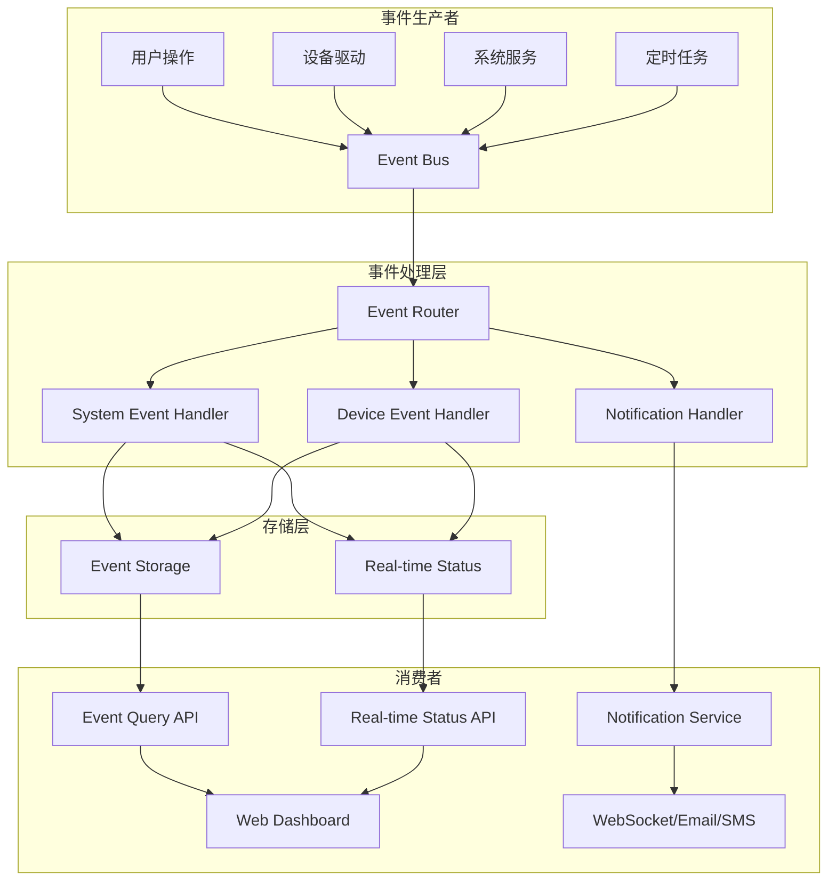

# 事件服务系统设计文档

## 概述

事件服务系统是IoT边缘网关的核心组件，负责处理系统事件和设备事件的生成、存储、查询、通知等功能。系统采用事件驱动架构，支持异步处理、实时状态管理和富文本内容。

## 架构设计

### 整体架构



### 核心组件

1. **Event Bus**: 事件总线，负责事件的分发和路由
2. **Event Handlers**: 事件处理器，处理不同类型的事件
3. **Event Storage**: 事件存储，持久化历史事件数据
4. **Real-time Status**: 实时状态管理，维护当前活跃事件
5. **Notification Service**: 通知服务，处理事件告警和推送
6. **Query Service**: 查询服务，提供事件检索和统计功能

## 架构决策说明

### 事件分类：持久事件 vs 瞬时事件

事件系统处理两种不同生命周期的事件：

**持久事件** → 写入 `events` 表，通过 REST API 查询
- 系统事件（用户认证、用户操作、系统配置变更）
- 设备告警事件（需要历史追踪）
- 设备业务事件（需要审计）

**瞬时事件** → 仅通过 Event Bus 触发，不落库
- 设备属性变更（设备状态变化，触发 SSE 推送，前端实时更新）
- 设备心跳（仅触发状态同步，不记录）
- 设备连接状态变化（触发通知，不重复存储）

瞬时事件的 SSE 推送丢失处理：SSE reconnect 时，客户端应从 `/api/v1/events/real-time` 重新拉取当前实时状态（RealTimeStatus 表），而非依赖重放。

### alarm 模块废弃

本 event-service 系统完全替代现有的 alarm 模块（`api/src/models/alarm.rs`）：
- 旧 alarm 模块**不再接收新事件**，仅保留历史数据只读
- 所有新告警由 event-service 的 `EventLevel::Error` / `EventLevel::Critical` 事件处理
- 通知规则（notification_rules）由 event-service 统一管理
- alarm 模块将在后续版本中移除

## 组件和接口设计

### 事件总线 (Event Bus)

```rust
pub struct EventBus {
    channels: HashMap<TypeId, Vec<Sender<Box<dyn Event>>>>,
    subscribers: Arc<RwLock<HashMap<TypeId, Vec<Box<dyn EventHandler>>>>>,
}

impl EventBus {
    pub async fn publish<T: Event + 'static>(&self, event: T) -> Result<()>;
    pub async fn subscribe<T: Event + 'static>(&self, handler: Box<dyn EventHandler<T>>) -> Result<()>;
    pub fn instance() -> &'static EventBus;
}
```

### 事件定义

```rust
// 基础事件特征
pub trait Event: Send + Sync + Clone + Debug {
    fn event_id(&self) -> String;
    fn event_type(&self) -> EventType;
    fn event_level(&self) -> EventLevel;
    fn timestamp(&self) -> DateTime<Utc>;
    fn source(&self) -> EventSource;
    fn content(&self) -> &RichContent;
}

// 事件类型枚举
#[derive(Debug, Clone, Serialize, Deserialize)]
pub enum EventType {
    System(SystemEventType),
    Device(DeviceEventType),
}

#[derive(Debug, Clone, Serialize, Deserialize)]
pub enum SystemEventType {
    UserAuth,      // 用户认证
    UserOperation, // 用户操作
    SystemConfig,  // 系统配置
    SystemError,   // 系统异常
}

#[derive(Debug, Clone, Serialize, Deserialize)]
pub enum DeviceEventType {
    Connection,    // 设备连接
    Property,      // 设备属性变化
    Command,       // 设备指令执行
    Business,      // 设备业务事件（由驱动产生）
}

// 事件级别
#[derive(Debug, Clone, Serialize, Deserialize, PartialEq, Eq, PartialOrd, Ord)]
pub enum EventLevel {
    Critical = 5,  // 故障
    Error = 4,     // 错误
    Warning = 3,   // 警告
    Info = 2,      // 消息
    Debug = 1,     // 调试
}
```

### 富文本内容

```rust
#[derive(Debug, Clone, Serialize, Deserialize)]
pub struct RichContent {
    pub title: String,
    pub elements: Vec<ContentElement>,
    pub metadata: HashMap<String, serde_json::Value>,
}

#[derive(Debug, Clone, Serialize, Deserialize)]
pub enum ContentElement {
    Text {
        content: String,
        format: TextFormat,
    },
    Image {
        url: Option<String>,
        alt_text: String,
        width: Option<u32>,
        height: Option<u32>,
    },
    Link {
        url: String,
        text: String,
        target: LinkTarget,
    },
    Table {
        headers: Vec<String>,
        rows: Vec<Vec<String>>,
    },
    Code {
        content: String,
        language: Option<String>,
    },
}

#[derive(Debug, Clone, Serialize, Deserialize)]
pub enum TextFormat {
    Plain,
    Markdown,
}
```

### 系统事件处理器

```rust
pub struct SystemEventHandler {
    storage: Arc<EventStorage>,
    real_time_status: Arc<RealTimeStatus>,
}

impl SystemEventHandler {
    pub async fn handle_user_auth_event(&self, event: UserAuthEvent) -> Result<()>;
    pub async fn handle_user_operation_event(&self, event: UserOperationEvent) -> Result<()>;
    pub async fn handle_system_config_event(&self, event: SystemConfigEvent) -> Result<()>;
    pub async fn handle_system_error_event(&self, event: SystemErrorEvent) -> Result<()>;
}

// 用户认证事件
#[derive(Debug, Clone, Serialize, Deserialize)]
pub struct UserAuthEvent {
    pub event_id: String,
    pub timestamp: DateTime<Utc>,
    pub user_id: String,
    pub username: String,
    pub ip_address: String,
    pub user_agent: String,
    pub auth_method: AuthMethod,
    pub auth_result: AuthResult,
    pub session_id: Option<String>,
}

// 用户操作事件
#[derive(Debug, Clone, Serialize, Deserialize)]
pub struct UserOperationEvent {
    pub event_id: String,
    pub timestamp: DateTime<Utc>,
    pub user_id: String,
    pub operation_type: OperationType,
    pub resource_type: String,
    pub resource_id: String,
    pub operation_params: serde_json::Value,
    pub operation_result: OperationResult,
    pub ip_address: String,
}
```

### 设备事件处理器

```rust
pub struct DeviceEventHandler {
    storage: Arc<EventStorage>,
    real_time_status: Arc<RealTimeStatus>,
}

impl DeviceEventHandler {
    pub async fn handle_device_connection_event(&self, event: DeviceConnectionEvent) -> Result<()>;
    pub async fn handle_device_property_event(&self, event: DevicePropertyEvent) -> Result<()>;
    pub async fn handle_device_command_event(&self, event: DeviceCommandEvent) -> Result<()>;
    pub async fn handle_device_business_event(&self, event: DeviceBusinessEvent) -> Result<()>;
}

// 设备连接事件
#[derive(Debug, Clone, Serialize, Deserialize)]
pub struct DeviceConnectionEvent {
    pub event_id: String,
    pub timestamp: DateTime<Utc>,
    pub device_id: String,
    pub device_name: String,
    pub connection_status: ConnectionStatus,
    pub connection_type: ConnectionType,
    pub ip_address: Option<String>,
    pub protocol: String,
}

// 设备属性事件
#[derive(Debug, Clone, Serialize, Deserialize)]
pub struct DevicePropertyEvent {
    pub event_id: String,
    pub timestamp: DateTime<Utc>,
    pub device_id: String,
    pub property_id: String,
    pub property_name: String,
    pub old_value: Option<serde_json::Value>,
    pub new_value: serde_json::Value,
    pub change_reason: PropertyChangeReason,
}

// 设备业务事件（由驱动自主产生）
#[derive(Debug, Clone, Serialize, Deserialize)]
pub struct DeviceBusinessEvent {
    pub event_id: String,
    pub timestamp: DateTime<Utc>,
    pub device_id: String,
    pub business_type: String, // 业务类型，如 "access_control", "sensor_reading", "maintenance"
    pub business_data: serde_json::Value, // 业务相关数据
    pub description: String,
    pub level: EventLevel,
}

// 设备驱动事件生成器
pub trait DeviceEventGenerator {
    /// 生成设备业务事件
    async fn generate_business_event(
        &self,
        business_type: &str,
        business_data: serde_json::Value,
        description: String,
        level: EventLevel,
    ) -> Result<DeviceBusinessEvent>;
    
    /// 生成设备属性报警事件
    async fn generate_property_alarm_event(
        &self,
        property_id: &str,
        alarm_rule_id: &str,
        trigger_value: serde_json::Value,
        threshold_value: serde_json::Value,
    ) -> Result<DevicePropertyEvent>;
}
```

## 数据模型

### 事件历史表 (events)

```sql
CREATE TABLE events (
    id TEXT PRIMARY KEY,
    event_type TEXT NOT NULL,
    event_subtype TEXT NOT NULL,
    event_level INTEGER NOT NULL,
    timestamp TEXT NOT NULL,
    source_type TEXT NOT NULL,
    source_id TEXT,
    title TEXT NOT NULL,
    content TEXT, -- JSON格式的富文本内容
    metadata TEXT, -- JSON格式的元数据
    user_id TEXT,
    device_id TEXT,
    property_id TEXT,
    created_at TEXT NOT NULL,
    INDEX idx_events_timestamp (timestamp),
    INDEX idx_events_level (event_level),
    INDEX idx_events_type (event_type, event_subtype),
    INDEX idx_events_device (device_id),
    INDEX idx_events_user (user_id)
);
```

### 实时事件状态表 (real_time_events)

```sql
CREATE TABLE real_time_events (
    id TEXT PRIMARY KEY,
    event_type TEXT NOT NULL,
    event_subtype TEXT NOT NULL,
    event_level INTEGER NOT NULL,
    source_type TEXT NOT NULL,
    source_id TEXT NOT NULL,
    device_id TEXT,
    property_id TEXT,
    title TEXT NOT NULL,
    content TEXT, -- JSON格式的富文本内容
    first_occurrence TEXT NOT NULL,
    last_update TEXT NOT NULL,
    occurrence_count INTEGER DEFAULT 1,
    acknowledged BOOLEAN DEFAULT FALSE,
    acknowledged_by TEXT,
    acknowledged_at TEXT,
    UNIQUE(source_type, source_id, event_type, event_subtype),
    INDEX idx_real_time_level (event_level),
    INDEX idx_real_time_device (device_id),
    INDEX idx_real_time_ack (acknowledged)
);
```

### 事件通知规则表 (notification_rules)

```sql
CREATE TABLE notification_rules (
    id TEXT PRIMARY KEY,
    name TEXT NOT NULL,
    description TEXT,
    event_type TEXT,
    event_subtype TEXT,
    event_level INTEGER,
    device_filter TEXT, -- JSON格式的设备过滤条件
    notification_methods TEXT NOT NULL, -- JSON数组: ["websocket", "email", "sms"]
    recipients TEXT NOT NULL, -- JSON数组: 接收人列表
    enabled BOOLEAN DEFAULT TRUE,
    created_at TEXT NOT NULL,
    updated_at TEXT NOT NULL
);
```

### 通知历史表 (notification_history)

```sql
CREATE TABLE notification_history (
    id TEXT PRIMARY KEY,
    event_id TEXT NOT NULL,
    rule_id TEXT NOT NULL,
    notification_method TEXT NOT NULL,
    recipient TEXT NOT NULL,
    status TEXT NOT NULL, -- "pending", "sent", "failed"
    sent_at TEXT,
    error_message TEXT,
    created_at TEXT NOT NULL,
    FOREIGN KEY (event_id) REFERENCES events(id),
    FOREIGN KEY (rule_id) REFERENCES notification_rules(id)
);
```

## 存储服务设计

### 事件存储服务

```rust
pub struct EventStorage {
    db: Arc<Database>,
    config: StorageConfig,
}

impl EventStorage {
    pub async fn store_event(&self, event: &dyn Event) -> Result<()>;
    pub async fn query_events(&self, query: &EventQuery) -> Result<Vec<StoredEvent>>;
    pub async fn get_event_statistics(&self, params: &StatisticsParams) -> Result<EventStatistics>;
    pub async fn cleanup_old_events(&self) -> Result<u64>;
    pub async fn export_events(&self, query: &EventQuery, format: ExportFormat) -> Result<Vec<u8>>;
}

#[derive(Debug, Clone)]
pub struct EventQuery {
    pub start_time: Option<DateTime<Utc>>,
    pub end_time: Option<DateTime<Utc>>,
    pub event_types: Option<Vec<EventType>>,
    pub event_levels: Option<Vec<EventLevel>>,
    pub device_ids: Option<Vec<String>>,
    pub user_ids: Option<Vec<String>>,
    pub keywords: Option<String>,
    pub page: u32,
    pub page_size: u32,
    pub sort_by: SortBy,
    pub sort_order: SortOrder,
}
```

### 实时状态服务

```rust
pub struct RealTimeStatus {
    db: Arc<Database>,
}

impl RealTimeStatus {
    pub async fn update_status(&self, event: &dyn Event) -> Result<()>;
    pub async fn resolve_status(&self, source_type: &str, source_id: &str, event_type: &EventType) -> Result<()>;
    pub async fn acknowledge_event(&self, id: &str, user_id: &str) -> Result<()>;
    pub async fn get_active_events(&self, filter: &RealTimeFilter) -> Result<Vec<RealTimeEvent>>;
    pub async fn get_status_summary(&self) -> Result<StatusSummary>;
}

#[derive(Debug, Clone)]
pub struct RealTimeEvent {
    pub id: String,
    pub event_type: EventType,
    pub event_level: EventLevel,
    pub source_type: String,
    pub source_id: String,
    pub device_id: Option<String>,
    pub property_id: Option<String>,
    pub title: String,
    pub content: RichContent,
    pub first_occurrence: DateTime<Utc>,
    pub last_update: DateTime<Utc>,
    pub occurrence_count: u32,
    pub acknowledged: bool,
    pub acknowledged_by: Option<String>,
    pub acknowledged_at: Option<DateTime<Utc>>,
}
```

## 通知服务设计

### 通知管理器

```rust
pub struct NotificationManager {
    rules: Arc<RwLock<Vec<NotificationRule>>>,
    channels: HashMap<NotificationMethod, Box<dyn NotificationChannel>>,
    history: Arc<NotificationHistory>,
}

impl NotificationManager {
    pub async fn process_event(&self, event: &dyn Event) -> Result<()>;
    pub async fn add_rule(&self, rule: NotificationRule) -> Result<()>;
    pub async fn update_rule(&self, id: &str, rule: NotificationRule) -> Result<()>;
    pub async fn delete_rule(&self, id: &str) -> Result<()>;
    pub async fn get_notification_history(&self, query: &NotificationQuery) -> Result<Vec<NotificationRecord>>;
}

pub trait NotificationChannel: Send + Sync {
    async fn send(&self, message: &NotificationMessage) -> Result<()>;
}

// WebSocket通知通道
pub struct WebSocketChannel {
    connections: Arc<RwLock<HashMap<String, WebSocketSender>>>,
}

// 邮件通知通道
pub struct EmailChannel {
    smtp_config: SmtpConfig,
}

// 短信通知通道
pub struct SmsChannel {
    sms_config: SmsConfig,
}
```

## API接口设计

### RESTful API

```rust
// 事件查询API
#[get("/api/v1/events")]
pub async fn get_events(
    Query(query): Query<EventQueryParams>,
    State(state): State<AppState>,
    _claims: Claims,
) -> Json<ApiResponse<PaginatedResponse<EventResponse>>>;

// 实时事件状态API
#[get("/api/v1/events/real-time")]
pub async fn get_real_time_events(
    Query(filter): Query<RealTimeFilterParams>,
    State(state): State<AppState>,
    _claims: Claims,
) -> Json<ApiResponse<Vec<RealTimeEventResponse>>>;

// 事件统计API (重命名为overview)
#[get("/api/v1/events/overview")]
pub async fn get_event_overview(
    Query(params): Query<OverviewParams>,
    State(state): State<AppState>,
    _claims: Claims,
) -> Json<ApiResponse<EventOverviewResponse>>;

// 确认实时事件API
#[post("/api/v1/events/real-time/{id}/acknowledge")]
pub async fn acknowledge_event(
    Path(id): Path<String>,
    State(state): State<AppState>,
    claims: Claims,
) -> Json<ApiResponse<bool>>;

// 通知规则管理API
#[get("/api/v1/notification-rules")]
pub async fn get_notification_rules(
    State(state): State<AppState>,
    _claims: Claims,
) -> Json<ApiResponse<Vec<NotificationRuleResponse>>>;

#[post("/api/v1/notification-rules")]
pub async fn create_notification_rule(
    Json(request): Json<CreateNotificationRuleRequest>,
    State(state): State<AppState>,
    _claims: Claims,
) -> Json<ApiResponse<NotificationRuleResponse>>;
```

### Server-Sent Events (SSE) API

```rust
pub struct EventSSEHandler {
    event_bus: Arc<EventBus>,
    connections: Arc<RwLock<HashMap<String, SSEConnection>>>,
}

impl EventSSEHandler {
    pub async fn handle_connection(&self, user_id: String) -> Result<Response<Body>>;
    pub async fn broadcast_event(&self, event: &dyn Event) -> Result<()>;
    pub async fn send_to_user(&self, user_id: &str, message: &SSEMessage) -> Result<()>;
}

#[derive(Debug, Clone, Serialize, Deserialize)]
pub struct SSEMessage {
    pub event_type: String,
    pub data: serde_json::Value,
    pub id: Option<String>,
    pub retry: Option<u32>,
}

// SSE相比WebSocket的优势：
// 1. 更简单的实现，自动重连机制
// 2. 更好的防火墙兼容性
// 3. 单向推送更适合事件通知场景
// 4. 浏览器原生支持，无需额外库
```

### WebSocket API (备选方案)

```rust
pub struct EventWebSocketHandler {
    event_bus: Arc<EventBus>,
    connections: Arc<RwLock<HashMap<String, WebSocketConnection>>>,
}

impl EventWebSocketHandler {
    pub async fn handle_connection(&self, ws: WebSocket, user_id: String) -> Result<()>;
    pub async fn broadcast_event(&self, event: &dyn Event) -> Result<()>;
    pub async fn send_to_user(&self, user_id: &str, message: &WebSocketMessage) -> Result<()>;
}

#[derive(Debug, Clone, Serialize, Deserialize)]
pub enum WebSocketMessage {
    EventNotification {
        event: EventResponse,
        notification_type: NotificationType,
    },
    RealTimeStatusUpdate {
        summary: StatusSummary,
    },
    SystemMessage {
        message: String,
        level: EventLevel,
    },
}

// WebSocket的优势：
// 1. 双向通信，支持客户端发送命令
// 2. 更低的延迟
// 3. 更灵活的消息格式
```

**推荐使用SSE的原因：**
1. **事件通知主要是单向推送**，不需要复杂的双向通信
2. **自动重连机制**，网络断开后自动恢复
3. **更好的兼容性**，不会被企业防火墙阻挡
4. **实现更简单**，减少维护成本
5. **浏览器原生支持**，前端实现更简洁
```

## 错误处理

### 错误类型定义

```rust
#[derive(Debug, thiserror::Error)]
pub enum EventError {
    #[error("Database error: {0}")]
    Database(#[from] sqlx::Error),
    
    #[error("Serialization error: {0}")]
    Serialization(#[from] serde_json::Error),
    
    #[error("Event validation error: {message}")]
    Validation { message: String },
    
    #[error("Event not found: {id}")]
    NotFound { id: String },
    
    #[error("Permission denied: {operation}")]
    PermissionDenied { operation: String },
    
    #[error("Notification error: {0}")]
    Notification(String),
    
    #[error("Configuration error: {0}")]
    Configuration(String),
}

pub type Result<T> = std::result::Result<T, EventError>;
```

### 错误处理策略

1. **数据库错误**: 记录详细日志，返回通用错误信息给客户端
2. **验证错误**: 返回具体的验证失败信息
3. **权限错误**: 记录安全日志，返回权限不足信息
4. **通知错误**: 记录失败原因，支持重试机制
5. **配置错误**: 启动时检查，运行时降级处理

## 正确性属性

*属性是一个特征或行为，应该在系统的所有有效执行中保持为真——本质上是关于系统应该做什么的正式声明。属性作为人类可读规范和机器可验证正确性保证之间的桥梁。*

### 属性 1: 事件分类正确性
*对于任何*创建的事件，系统应该根据事件的源类型和内容自动分配正确的事件类型和子类型，确保系统事件和设备事件都被正确分类到对应的子类中
**验证需求: Requirements 1.1, 1.2, 1.3**

### 属性 2: 事件级别自动分配
*对于任何*创建的事件，系统应该根据事件的严重程度和内容自动分配适当的级别（故障、错误、警告、消息、调试），确保级别分配的一致性和准确性
**验证需求: Requirements 2.2**

### 属性 3: 富文本内容序列化往返
*对于任何*有效的富文本内容对象，序列化为JSON然后反序列化应该产生等价的对象，保持所有文本、图片、链接、表格等元素的完整性
**验证需求: Requirements 3.1, 3.2**

### 属性 4: 事件记录完整性
*对于任何*系统事件或设备事件，记录的事件应该包含所有必需的字段信息，如用户认证事件包含用户ID、IP地址、登录时间、认证结果，设备连接事件包含设备ID、连接状态、连接时间、连接方式
**验证需求: Requirements 4.1, 5.1**

### 属性 5: 事件存储并发安全性
*对于任何*并发的事件存储操作，系统应该保证数据的一致性和完整性，支持事务处理，避免数据竞争和丢失
**验证需求: Requirements 6.1**

### 属性 6: 事件自动清理机制
*对于任何*超过配置限制的事件数据，系统应该自动清理最旧的事件，保留最近的数据，确保存储空间的有效管理
**验证需求: Requirements 6.2**

### 属性 7: 事件查询过滤正确性
*对于任何*事件查询请求，系统应该根据指定的过滤条件（时间范围、事件级别、事件类型等）返回准确的结果集，不包含不符合条件的事件
**验证需求: Requirements 7.1, 7.2**

### 属性 8: 通知触发及时性
*对于任何*故障级别的事件，系统应该立即触发通知机制，确保关键事件能够及时传达给相关人员
**验证需求: Requirements 8.1**

### 属性 9: 事件统计准确性
*对于任何*时间范围内的事件数据，系统提供的统计信息（按级别和类型分组的数量）应该与实际存储的事件数据完全一致
**验证需求: Requirements 9.1**

### 属性 10: API接口一致性
*对于任何*通过API接口进行的事件操作（创建、查询、更新、删除），系统应该返回统一格式的响应，并正确执行相应的业务逻辑
**验证需求: Requirements 10.1**

### 属性 11: 实时状态管理正确性
*对于任何*设备属性的状态变化，系统应该正确维护实时事件状态表：报警时创建或更新记录，恢复正常时删除记录，反复变化时仅保持最新状态，历史变化记录在事件历史表中
**验证需求: Requirements 12.1, 12.2, 12.3, 12.4**

### 属性 12: 权限控制有效性
*对于任何*用户的事件访问请求，系统应该根据用户的角色和权限正确允许或拒绝访问，确保敏感事件数据的安全性
**验证需求: Requirements 13.1**

## 错误处理

### 错误类型定义

```rust
#[derive(Debug, thiserror::Error)]
pub enum EventError {
    #[error("Database error: {0}")]
    Database(#[from] sqlx::Error),
    
    #[error("Serialization error: {0}")]
    Serialization(#[from] serde_json::Error),
    
    #[error("Event validation error: {message}")]
    Validation { message: String },
    
    #[error("Event not found: {id}")]
    NotFound { id: String },
    
    #[error("Permission denied: {operation}")]
    PermissionDenied { operation: String },
    
    #[error("Notification error: {0}")]
    Notification(String),
    
    #[error("Configuration error: {0}")]
    Configuration(String),
}

pub type Result<T> = std::result::Result<T, EventError>;
```

### 错误处理策略

1. **数据库错误**: 记录详细日志，返回通用错误信息给客户端
2. **验证错误**: 返回具体的验证失败信息
3. **权限错误**: 记录安全日志，返回权限不足信息
4. **通知错误**: 记录失败原因，支持重试机制
5. **配置错误**: 启动时检查，运行时降级处理

## 测试策略

### 双重测试方法

**单元测试**：验证具体示例、边界情况和错误条件
- 事件处理器的业务逻辑测试
- API接口的输入验证测试
- 边界条件测试（如内容大小限制）
- 错误处理和异常情况测试

**属性测试**：验证跨所有输入的通用属性
- 每个属性测试运行最少100次迭代
- 使用随机生成的事件数据验证系统行为
- 测试标签格式：**Feature: event-service-system, Property {number}: {property_text}**

### 属性测试配置

使用Rust的`proptest`库进行属性测试：
- 最小100次迭代确保充分的随机输入覆盖
- 每个正确性属性对应一个独立的属性测试
- 智能生成器约束输入空间到有效范围
- 测试失败时提供具体的反例用于调试

### 集成测试

- 事件端到端流程测试
- 数据库事务和并发测试
- WebSocket连接和消息推送测试
- 通知渠道集成测试

### 性能测试

- 高并发事件处理测试
- 大量数据查询性能测试
- 实时状态更新性能测试
- 内存使用和垃圾回收测试